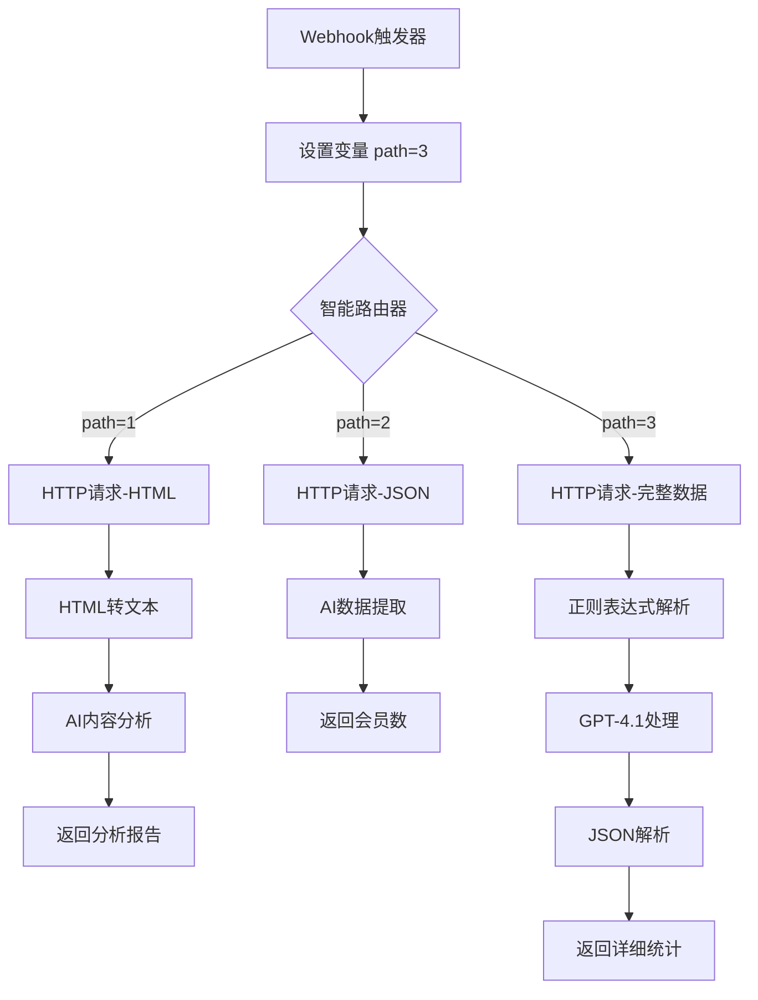

# 技术架构详解

## 流程图



## 模块详细配置

### 1. Webhook触发器 (ID: 1)
```json
{
    "module": "gateway:CustomWebHook",
    "parameters": {
        "hook": 2268115,
        "maxResults": 1
    }
}
```

### 2. 变量设置模块 (ID: 11)
```json
{
    "module": "util:SetVariable2",
    "mapper": {
        "name": "path",
        "scope": "roundtrip",
        "value": "3"
    }
}
```

### 3. 路由器配置 (ID: 3)
- **分支1条件**: `{{11.path}} == "1"`
- **分支2条件**: `{{11.path}} == "2"`  
- **分支3条件**: `{{11.path}} == "3"` (默认)

## 各分支详细流程

### 分支1: HTML内容分析

**目标**: 分析网页HTML内容，提取Skool社群基本信息

1. **HTTP请求模块 (ID: 2)**
   - URL来源: `{{1.events[].message.text}}`
   - 方法: GET
   - 启用GZIP压缩
   - 错误处理: 启用

2. **HTML转文本模块 (ID: 5)**
   - 输入: `{{2.data}}`
   - 换行格式: Linux (LF)
   - 标题大写: 启用

3. **AI分析模块 (ID: 8)**
   - 提示词: "將以下的內容, 仔細分類出對分析有幫助的內容(含Skool 名稱及群長名), 並以報告方式呈現, 限制200字"
   - 输入: `{{5.text}}`

4. **响应模块 (ID: 10)**
   - 状态码: 200
   - 响应体: `{{8.answer}}`

### 分支2: 会员数据提取

**目标**: 提取社群会员数量统计

1. **HTTP请求模块 (ID: 4)**
   - URL来源: `{{1.events[].message.text}}`
   - 内容类型: application/json
   - 方法: GET

2. **AI提取模块 (ID: 7)**
   - 输入: `{{4.data}}`
   - 提取字段: 
     ```json
     {
         "name": "member",
         "type": "number", 
         "description": "會員人數"
     }
     ```

3. **响应模块 (ID: 9)**
   - 格式: "`{{URL}}` 的會員數: `{{7.member}}` 個會員"

### 分支3: 详细统计分析 (默认路径)

**目标**: 获取完整的社群统计数据

1. **HTTP请求模块 (ID: 12)**
   - URL来源: `{{1.events[].message.text}}`
   - 方法: GET
   - 无特定内容类型

2. **正则解析模块 (ID: 13)**
   - 模式: `"totalAdmins":.*?"onlineUsers":\[\]\}`
   - 多行模式: 启用
   - 大小写敏感: 禁用

3. **GPT处理模块 (ID: 14)**
   - 模型: gpt-4.1-mini
   - 角色: user
   - 提示: "將以下資料轉成JSON格式"
   - 输入: `{{13.__IMTMATCH__}}`
   - 响应格式: JSON对象

4. **JSON解析模块 (ID: 15)**
   - 输入: `{{14.choices[].message.content}}`

5. **响应模块 (ID: 16)**
   - 格式化输出:
     ```
     {{URL}} 查詢結果:
     1 總會員數: {{15.totalMembers}}
     2 總貼文數: {{15.totalPosts}}
     3 此Skool創建日: {{formatDate(15.createdAt; "YYYY-MM-DD hh:mm A"; "Asia/Taipei")}}
     ```

## 错误处理机制

- **HTTP模块**: 启用错误处理，非2xx/3xx状态码视为错误
- **场景设置**: 最大错误次数3次
- **自动提交**: 启用
- **重定向**: 支持跟踪

## 性能优化

- **GZIP压缩**: 减少网络传输数据量
- **变量作用域**: roundtrip级别，优化内存使用
- **条件过滤**: 精确的路径匹配，避免不必要的执行

## 数据映射

### 输入数据流
```
Webhook → events[].message.text → HTTP URL
```

### 输出数据流
```
分支1: HTML → 文本 → AI分析 → 报告
分支2: JSON → AI提取 → 会员数
分支3: 原始数据 → 正则 → GPT → JSON → 格式化统计
```

## 部署要求

### 必需的连接配置
1. **Make.com订阅**: 需要支持AI工具的付费计划
2. **OpenAI连接**: GPT-4.1-mini访问权限
3. **Webhook URL**: 公网可访问的端点

### 环境变量
- 无需额外环境变量，所有配置内嵌在蓝图中

### 网络要求
- 出站HTTP/HTTPS访问
- 支持GZIP压缩
- SSL/TLS连接支持

## 监控和日志

- **执行历史**: Make.com自动记录每次执行
- **错误追踪**: 详细的错误信息和堆栈追踪
- **性能指标**: 执行时间、数据传输量统计

## 扩展性考虑

1. **新增数据源**: 可轻松添加新的HTTP源
2. **自定义AI提示**: 可修改AI模块的分析逻辑
3. **输出格式**: 支持多种响应格式
4. **并发处理**: 支持多个并发请求

---

*该技术文档为Skool静态网页爬虫自动化蓝图的深度技术分析，涵盖了架构设计、配置详情和运维要求。*
